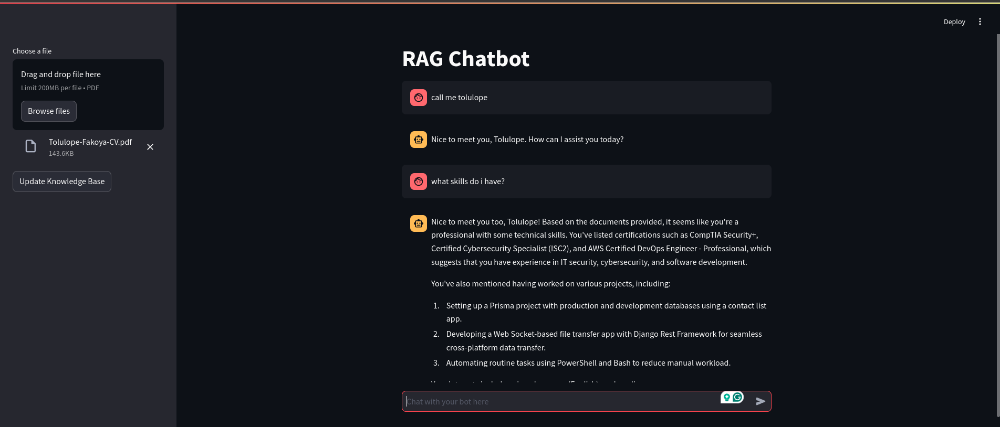

# LocalRAGify: Zero-Cost Local RAG Chatbot  

**LocalRAGify** is a free, local Retrieval-Augmented Generation (RAG) system that combines open-source tools like OpenSearch and Ollama with a user-friendly chat interface powered by Streamlit. This project enables you to set up a cost-effective chatbot capable of answering queries using both retrieval and generative AI techniques.  


---

## **Features**  
- **Zero-Cost**: Fully local deployment using free and open-source tools.  
- **Generative AI**: Powered by the Ollama LLM for interactive responses.  
- **Custom Retrieval**: Integrates with OpenSearch for document retrieval.  
- **User-Friendly Interface**: Built with Streamlit for seamless interaction.  

---

## **Getting Started**  

Follow these steps to set up and run the application locally using Docker Compose.  

### **Prerequisites**  
1. Docker and Docker Compose installed on your machine.  
   - [Install Docker](https://docs.docker.com/get-docker/)  
   - [Install Docker Compose](https://docs.docker.com/compose/install/)  
2. Python 3.6+ installed (for local edits or testing).  

### **File Structure**  
Ensure the following files are present in your project directory:  
```
.
├── dockerfile
├── compose.yml
├── app.py
├── llama.py
├── requirements.txt
```

### **Steps to Run the App**  

1. **Clone the Repository**  
   ```bash
   git clone https://github.com/your-repo-name/localragify.git
   cd localragify
   ```

2. **Build and Start Services**  
   Use Docker Compose to build and run the application:  
   ```bash
   docker-compose up --build
   ```  

   This command:  
   - Pulls the required images for OpenSearch and Ollama.  
   - Builds the LocalRAGify app Docker image.  
   - Starts both the OpenSearch vector store and the chatbot application.  

3. **Access the Chat Interface**  
   Once the containers are up and running, access the chatbot via your browser at:  
   ```
   http://localhost:8501
   ```  

4. **Verify OpenSearch Service**  
   The OpenSearch vector store is available at:  
   ```
   http://localhost:9200
   ```  

## **Contributing**  
I welcome contributions! Feel free to open issues or submit pull requests for improvements.  

---

## **License**  
This project is licensed under the MIT License.  

---

## **Acknowledgments**  
- [Ollama](https://ollama.ai/) for the local LLM framework.  
- [OpenSearch](https://opensearch.org/) for the vector database functionality.  
- [Streamlit](https://streamlit.io/) for the interactive web interface.  

Enjoy building your zero-cost local RAG chatbot with LocalRAGify! 🚀